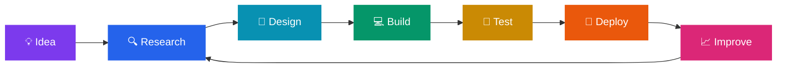

<div align="center">

# ⚡ Nimisha Borah

### `AI × Web × Hardware × Logic`

**Building intelligent interfaces, experimenting with AI, and turning digital ideas into real hardware.**

<p>
  <a href="#-what-i-build"></a>
  <a href="#-featured-work"></a>
  <a href="#-tech-stack"></a>
  <a href="#-connect"></a>
</p>


</div>

---

## 👋 About Me

I'm an **ECE student and builder** who enjoys working at the intersection of:

```text
┌──────────────────────────────────────────────────────────────────┐
│                                                                  │
│   🤖 AI                🌐 Web Apps             🔌 Hardware       │
│   ML-powered ideas    Interactive UIs         Verilog / RTL      │
│   Automation          Full-stack systems      Digital Logic      │
│   Intelligent tools   Practical products      Embedded Systems   │
│                                                                  │
└──────────────────────────────────────────────────────────────────┘
```

I like projects that don't stop at a demo — I want them to become **usable, understandable, and deployable systems**.

---

## 🚀 What I Build

<table>
<tr>
<td width="50%" valign="top">

### 🤖 AI-Powered Web Projects

- AI-assisted productivity tools
- Intelligent web interfaces
- Automation-focused applications
- Responsive, mobile-first experiences
- APIs, dashboards & data workflows
- Practical AI features users can actually use

</td>
<td width="50%" valign="top">

### 🔌 Verilog & Hardware

- RTL design
- Digital logic systems
- Verilog / HDL projects
- FPGA-oriented development
- Embedded systems
- Hardware + software integration

</td>
</tr>
</table>

---

## 🧠 My Build Philosophy



> **Build something useful → make it work → make it better.**

---

## ✨ Featured Work

### 🐍 S.C.A.L.E. — Intelligent Snake Robot

**Slithering Cognitive Agent for Lifesaving Exploration**

A reinforcement-learning project focused on **vision-based snake robot locomotion for disaster-rubble exploration**.

**Highlights**
- PPO-based reinforcement learning
- Gymnasium simulation environment
- LiDAR-based perception
- Curriculum learning
- Domain randomization
- Obstacle-aware locomotion
- Exploration and navigation rewards
- Designed with future Raspberry Pi deployment in mind

`Python` `PPO` `Gymnasium` `PyBullet` `LiDAR` `RL` `Robotics`

---

### ☀️ Perovskite Solar Cell Simulation

Research-oriented simulation of **2D/3D bilayer perovskite solar cells** using SCAPS-1D.

**Reported device performance**
- **PCE:** 30.17%
- **Voc:** 1.3475 V
- **Jsc:** 26.65 mA/cm²
- **FF:** 84.02%

`SCAPS-1D` `Solar Cells` `Simulation` `Research` `Materials`

---

### 💧 Smart Irrigation — TinyML + ESP32

An intelligent irrigation controller using sensor data to predict whether watering is required.

**System concept**

```text
🌱 Soil Moisture ─┐
🌡️ Temperature ───┼──> 🧠 Decision Tree ──> 🔌 Relay ──> 💧 Pump
💨 Humidity ───────┘
                         │
                         └──> ESP32
```

`ESP32` `TinyML` `Decision Tree` `IoT` `Embedded Systems`

---

## ⚙️ Tech Stack

### 🤖 AI / ML

<p>


</p>

### 🌐 Web / Software

<p>


</p>

### 🔌 Hardware / HDL

<p>


</p>

### 🛠️ Tools

<p>


</p>

---

## 📊 GitHub Activity

<div align="center">


<br>


</div>

---

## 🐍 Contribution Snake

<div align="center">

<!-- Generate this animation with the GitHub Action described below -->


</div>

---

## 📌 Currently Exploring

```text
[████████████████████░░]  AI-powered product development
[██████████████████░░░░]  Full-stack web applications
[███████████████░░░░░░░]  Verilog & RTL design
[██████████████░░░░░░░░]  Embedded / IoT systems
[████████████░░░░░░░░░░]  Reinforcement learning
```

---

## 🎯 2026 Focus

| Area | Goal |
|---|---|
| 🤖 AI | Build practical AI-powered products |
| 🌐 Web | Create polished, responsive applications |
| 🔌 Hardware | Strengthen Verilog, RTL & digital design |
| 🧠 Systems | Connect AI/software with real-world hardware |
| 🚀 Portfolio | Turn experiments into production-quality projects |

---

## 💡 What You'll Find Here

```text
AI Projects        →  🧠 Intelligent features & automation
Web Projects       →  🌐 Interfaces people can actually use
Verilog Projects   →  🔌 RTL, digital logic & hardware
Embedded Projects  →  ⚙️ Sensors, controllers & IoT
Research           →  🔬 Experiments, simulations & technical work
```

---

## 🤝 Let's Build Something

I'm interested in projects that combine **AI + software + electronics** to solve practical problems.

<div align="center">

### `Ideas → Code → Circuits → Intelligent Systems`

<a href="https://github.com/NimishaBorah">
  
</a>

<a href="mailto:YOUR_EMAIL@example.com">
  
</a>

</div>

---

<div align="center">


**⭐ If something here helps you, consider giving the repository a star.**

</div>
